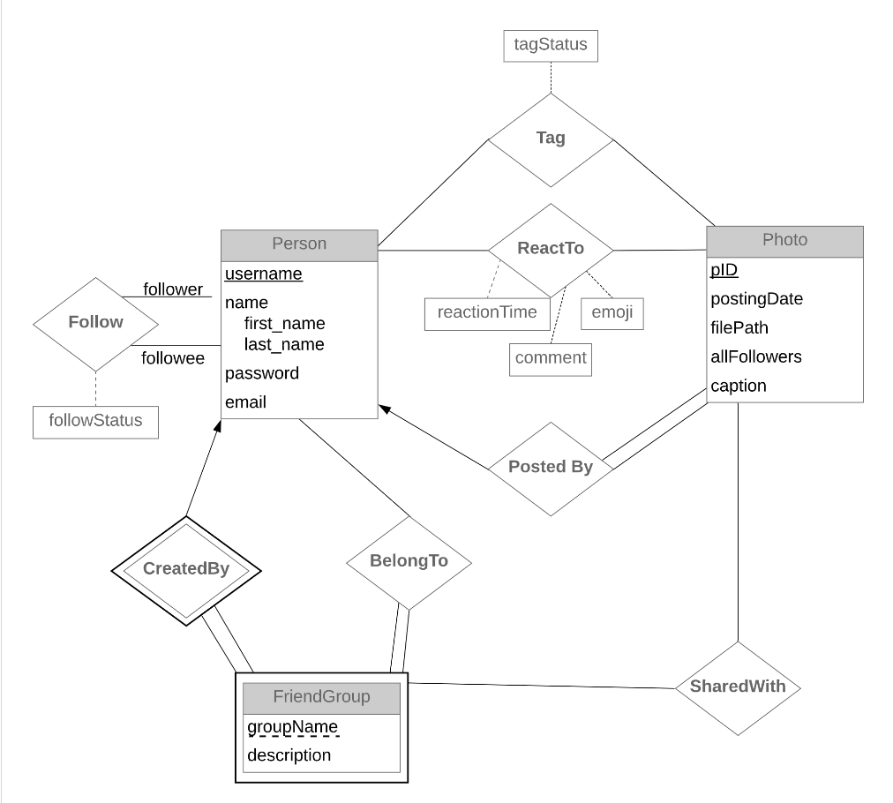

# Finstagram

# Project Overview

Finstagram is a web application for sharing photos. It gives users more privacy than many photo sharing sites by giving them more detailed control over who can see which photos they post. The focus of the project is on storing data about who posted which photos and who has permission to view them, tag others in them, see who’s tagged in what, etc.
Users are able to log in, make, accept or reject follow requests, create and add friends to friendgroups, post photos and designate who can view them, view photos that they have access to and data about these photos (detailed below), as well as take other actions such as tagging, liking, and/or commenting on photos they can view.

# ER diagram for the database

 

# Features

* (Tracy)
1. Follow - users can find other registered users and make a request to follow them
2. Accept/ reject requests - users are able view follow requests from others users and accept/reject them
3. Unfollow - users can unfollow other users that they no longer wish to follow. Once you unfollow a user, any tags that you had included them in will be deleted.
4. Create friend group - users can create new frinedgroups. A user is a member of each friendgroup that they create
5. Add to friendgroup - users can add friends to their friendgroups

* (Jude)
6. Post photos and designate who can view them - users can post photos with caption and make it visible to all followers
7. Tag photos - users can propose to tag other users in photos. They can only propose to tag a user only if the photo is visible to both of them
8. Accept/Recject Tag - users can choose to accept ot reject a tag proposed to them 
9. Share Photos - User can share photos they posted that are not visible to all followers to a friendgroup that they belong to.

* (Srashta)
9. View Visible Photos - a photo is visible to the user if i) They posted it themselves, ii) the photo is posted by a user they follow(and the poster has made the photo visible to their followers) iii) the photo is shared with a friendgroup that the user belongs to.
10. View Further photo info: users can view the photoID, username, first name, last name, tagged people(if tag is accepted) and posting date of each visible photo. All photos are arranged so that the most recent photo shows up at the top.
11. Search By Poster - Users can search for photos that are visible to them and posted by a particular user. The poster should be someone they follow, or belong to a friendgroup that the user is also a part of 
12. Search by tag - users can search for photos that are visible to them and that tag some particular person (the user or someone else )

 
